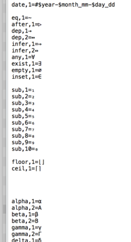
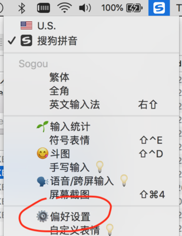
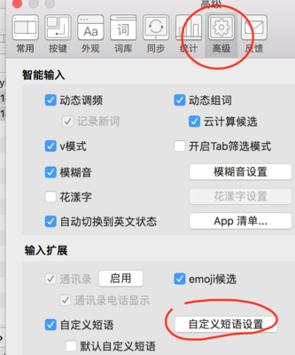
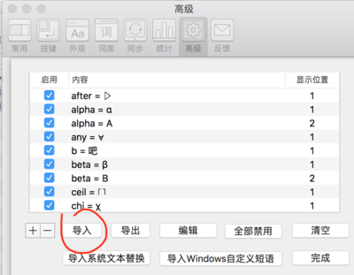
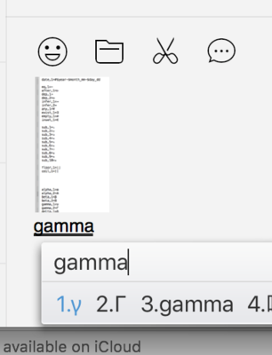

# Project learn

A collection of resource about engineering, devops etc.

Official site: [openacid.github.io/learn](https://openacid.github.io/learn/)

## Code styles

[General development guide](code-style/general)

-   [Lua code style](code-style/lua)

-   [Python code style](code-style/python) based on [Google python style guide](code-style/google-python-style-guide)

-   [Shell style guide by google](code-style/google-shell-style-guide)

-   [Goland style](code-style/go)

##  Git

-   [Git usage guide](dev/git-guide)

-   [How to write a git commit message](dev/how-to-write-a-git-commit-message)

##  Utils

-   数学符号输入-搜狗拼音短语配置:

    1. 下载短语配置 [sougou-pinyin-phrases.ini](productivity/sougou-math/sougou-pinyin-phrases.ini)

    

    1. 导入到搜狗自定义短语(导入时不会覆盖已有的)

    
    
    

    1. 输入gamma, 得到γ的提示:

    

    **欢迎提pr, 共享好用的快捷方式**~

-   数学符号输入-对vim患者:

    `ctrl-k g *` 是输入gamma(γ)

    see: `:help digraph`
