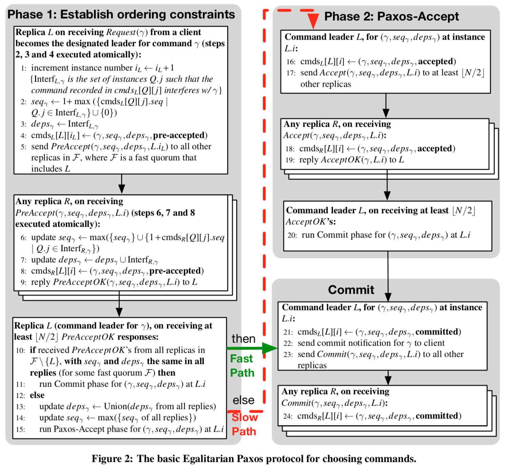

#在平等的议会中有更多的一致

##摘要
本文描述了一种基于paxos的新型分布式算法Egalitarian Paxos (EPaxos)的设计与实现。
epaxos实现了三个目标：
（1）在现实条件下，当能够容忍一个或者两个失败的情况下，在广域网中具有最佳的提交延迟。
（2）在所有的副本之间进行统一的负载均衡（从而实现高吞吐率）。
（3）当副本变慢或者崩溃时，性能会平滑下降（graceful performance degradation）。

据我们所知，epaxos是第一个有效实现上述目标的协议。也就是说，只要求一个简单的副本多数派不出现故障，使用数量与副本个数成线性关系的消息来选择command。并且在通常情况下，只在一个communicate round（一次往返）之后就可以提交command，或者在任何情况下，最多两个communicate round提交command。我们从理论上证明了epaxos的特性，并且通过在Amazon EC2上运行的一个epaxos实现上，经验性地展示了它的优势。

##1.引论
分布式计算对复制（基于副本的）协议提出了两个主要要求：
（1）计算集群内部复制（副本）的高吞吐率。
（2）跨数据中心的复制（副本）的低延迟。
当今的集群使用容错协调引擎，例如，chubby，Box-wood，或者zookeeper来进行，例如，操作顺序化，协调，选举以及资源发现的操作。很多数据库被来自不同大陆的请求并发访问，需要基于地理的复制。

这些系统的一个重要限制是，在高效的，无故障的运行过程中，所有的客户端都一直和单个leader通信。对于基于Paxos的系统来说，这个优化叫做”Multi-Paxos”，对于在实际系统中实现高吞吐率至关重要。更换leader需要调用额外的一致性机制，这会大大的降低性能。

这个算法的局限性有一些重要的后果。首先，它在master上施加不成比例的高负载而损害了系统的伸缩性（scalability），master上必须处理比其他副本机器更多的消息[23]。其次，在执行基于地理位置的复制时（geo-replication），客户端会出现因为要和远端的master通信而产生的额外延迟。第三，我们在本文中所展示的一样，传统的paxos对于长期和瞬时的负载峰值以及导致master延迟的网络延迟都非常敏感。最后，单个master的优化方式可能会损害可用性（availability）：如果master失败，那么系统在选择出新master之前，将无法为请求提供服务。前面提出的解决方案，例如，分区或者使用代理服务器都是不可取的，因为它们限制了集群可以执行的操作的类型。例如，在不使用额外操作的前提下，一个集群无法执行跨分区的原子操作。

epaxos没有指定的leader进程，取而代之的是，client可以在每一个步骤中自行选择向哪个副本提交命令，并且在大多数情况下，该命令是在不干扰其他并发命令的情况下提交的。这允许系统将负载平均的分配给所有的副本机器，从而消除了前面确定的第一个瓶颈（也就是，有一个必须在所有通信的关键路径上的服务器）。epaxos的灵活负载分配可以更好的处理永久的或者暂时性的慢节点，以及由于副本机器地理位置分布导致的延迟异构性。这大大的降低了中间和结尾提交的延迟。最后，系统在故障的情况下，能够提供更高的可用性（availability）和更高的性能，因为不存在因为leader选举导致的暂时中断：不存在leader，因此，只要大多数副本可用就不需要leader的选举。

在section2中，我们从重新回顾核心paxos算法以及epaxos背后的直觉开始。接着，在section3中，我们描述了一些能够减少开销和commit延迟的paxos变种。在整篇论文中，我们和Multi-Paxos以及两个最新的paxos衍生版本（Mencius[23]，Generalized Paxos[17]）进行了广泛的对比。Mencius通过在副本间使用round-robin的方式来分摊master的职责，成功的分担了master的负载。Generalized Paxos引入了一种思想，在状态机副本中可以独立地提交非冲突写，以优化commit延迟。我们在section7中的结果证明，Mencius是有效的，但是只有当节点都是同类型的时候才有效。Epaxos在各种现实条件下，都能够实现更高的吞吐率和更好的性能稳定性，例如，广域网副本，故障，不同性能的节点。Generalized Paxos依赖于单个master节点，因此会遇到相关的问题（single master带来的问题）。

##2.概述
我们从简要的描述经典的paxos算法开始，然后进行epaxos的概述。

###2.1 Paxos背景
状态机复制（state machine replication）旨在是一组可能发生故障的分布式处理器（副本），以相同的顺序执行相同的命令。因为每一个处理器都是没有任何其他输入的状态机，所以所有无故障的处理器都将经历相同的状态转换序列。给定一个状态序列中的指定位置，运行Paxos可以保证，如果以及当终止时，所有的无故障副本都同意将一个（相同的）命令分配给该位置。为了能够取得进展（progress），最多只能有少数派副本出现故障 —— 如果N是副本总数，那么Paxos至少需要⌊N/2⌋ + 1个无故障副本才能取得进展。Paxos，EPaxos以及其他常见的Paxos变种只能处理非拜占庭故障（non-Byzantine failures）：副本可能崩溃，或者可能无法无限期（一直）地响应来自其他副本的消息；但是，它不能以不符合协议的方式进行响应。

TODO：指明非拜占庭故障的例子。

使用Paxos的复制状态机的执行作为一系列的预定（pre-ordered）实例进行，其中每一个实例的输出（outcome，结果）都是对一个单独command的agreement（同意，一致）。一个实例的表决过程可以与其他实例的表决过程同时进行，但是不会互相干扰。

当从客户端收到一个命令请求的时候，一个副本将通过向至少多数派个副本（可能包括它自己）发送Prepare消息，来尝试成为一个尚未被占用的leader实例。对Prepare的应答中包含应答副本认为在这次投票中可能已经选择出的command（在这种情况下，新的leader将不得不使用这个命令而不是提出新的命令），并且还承诺不再认可之前leader发送的旧消息。如果在Prepare阶段，leader接收到了至少⌊N /2⌋ + 1个确认，它将继续以Accept message的形式将它提出的command发送给多数派；如果这些消息也得到了多数派的确认，那么leader在本地提交这个command，然后异步的通知所有的节点（peer）和客户端。

由于这种规范的操作模式需要至少两轮通信（两次往返）才能提交一个命令 —— 并且在争当leader的时候需要更多轮通信 —— 因此广泛使用的Multi-Paxos优化将一个固定的副本指定为稳定的leader（或者叫特殊的，杰出的proposer）。一个副本通过同时为大量（可能是无限）的实例执行prepare phase来成为这个稳定的leader，从而获取到了他们的所有权。在稳定的状态下，客户端只向这个稳定的leader发送command，稳定的leader在它所拥有的实例上直接推举command（也就是说，不运行prepare phase）。当一个非leader的副本怀疑leader已经故障了的时候，它将通过获取实例的所有权来成为新的leader，在这些实例上，它认为还没有选择出command。

section 3讨论了几个在basic paxos做了优化的一些Paxos变种。

###2.2 Egalitarian Paxos：贡献和直觉
在设计EPaxos的时候，主要的目标是：
（1）在广域网环境下优化提交延迟
（2）在所有的副本中优化负载均衡，进而提高吞吐量
（3）在一些副本变慢或者崩溃的时候，性能会正常的下降（性能退化到一个合理的范围中）。
为了实现这些目标，EPaxos必须允许所有的副本同时充当proposer（或者叫command leader），以使得client不浪费到远程站点的往返行程（round-trip），并且功能必须在所有的副本中很好的平衡。此外，每一个proposer在于尽可能少的远程副本进行通信后必须能够提交命令（也就是说，quorum必须尽可能的小）。最后，quorum的组成必须灵活，以方便command leader能够轻松的避开那些慢的或者没有响应的副本。

EPaxos通过新颖的命令编排方式来实现这些目标。以前的算法要么让单个稳定leader来选择命令顺序（Multi-Paxos和Generalized Paxos），要么将command分配到预先排好序的实例空间中的实例（也就是，command slots）（例如在规范Paxos和Mencius中），其中command的顺序就是command所在的相应slot的预定义顺序。相反的，EPaxos以分散和动态的方式为command instance排序：在从实例中选择（即，投票）命令的过程中，每一个参与者都会给那个command附加排序约束。EPaxos保证所有的非故障副本都将以相同的约束提交相同的命令，因此每个副本都可以使用这些约束来独立地达到相同的顺序。

这种排序方法是EPaxos与以前的算法相比所具有的优势的根源。首先，提交一个command取决于任何一个多数派的输入（和Multi-Paxos不同，稳定的leader必须是每个决策的一部分，和Mencius也不同，它需要所有的副本信息）（只要是有多数派个副本即可）—— 这有益于广域网的提交延迟，可用性，并且提高了性能的鲁棒性，因为它将最快副本的性能和最慢副本的性能脱钩（快的不受慢的影响）。其次，任何副本都能够提议一个command，不只是那个特殊的proposer或者叫leader —— 这可以实现负载均衡，从而提高吞吐量。

采用这种排序方法的时候，EPaxos必须维护安全性并且提供一个线性化的命令排序，同时将必须参与每个命令投票的副本个数以及它们之间交换的消息数量最小化。一个观察到的现象使得这个任务变的简单，方法的核心想法在于充分的减少常见（多数）情况下的排序约束数量，就像在我们之前的generic broadcast算法和Generalized Paxos所做的一样：对于一般情况下那些互不干扰的命令，没有必要强制要求一个一致的命令顺序。

图一. EPaxos消息流。R1，R2 … R5是五个副本。命令C1和C2（左边的）互不干扰，所以都能够在 fast-path上提交。C3和C4（右边）相互干扰，所以其中一个（C3）在slow-path上提交。C3->C4表明C3依赖于C4。为了清晰起见，我们忽略了异步提交消息。

图一展示了一个EPaxos工作方式的简化例子。客户端可以将任何command发送到任何副本—— 我们将此副本称为这个command的command leader，但请不要和Multi-Paxos中的稳定leader混淆。在实际的工作负载下，并发的proposal相互干扰的情况很少（目前，将这种一般情况考虑成更新不同对象的并发命令）。只在command leader和一共fast-path quorum个副本—— F + ⌊（F+1）/2⌋，之间进行一轮通信之后，EPaxos就能够提交这些命令，其中，包括command leader自己，F是能够容忍的失败个数（在图一的例子中，F为2）。

当命令相互干扰时，它们之间相互依赖 —— 和command一起提交的属性，用来确定执行命令的正确顺序 （提交和执行命令的顺序不一定相同，但是这个并不会影响正确性）。为了确保即使出现故障，每个副本都能提交相同的属性，可能需要在command leader和经典quorum个节点 —— F+1 个副本（包括command leader），之间进行第二轮通信（如图一所示，用于C3）。我们叫这种情况为slow-path。

##3.与相关工作的比较
Multi-Paxos[15，16]依靠稳定的leader副本来实现有效的消息转发进展，该leader代理client和其他副本的通信。对于N个副本来说，对于每个command，leader都处理Θ(N)个消息，非leader副本只处理O(1)个消息。因此，正如Paxos的实际实现锁观察到的那样，leader可能成为瓶颈。当leader失败时，状态机暂时不可用，知道选举出一个新的leader为止。这个问题不容易解决：如果多个副本都认为自己是leader，那么激进的leader改选可能会导致停滞。Chubby[4]和Box-wood[22]使用Multi-Paxos，而zookeeper[12]依赖于一个类似Multi-Paxos的稳定leader协议。

Mencius [23]通过为每一个command轮转Paxos leader来在副本之间平均分配负载。实例空间在所有副本之间进行了预先的分区：副本Rid拥有每一个实例i，i mode N = Rid。这种方法的缺点在于，每个副本都必须在提交命令A之前，从所有的副本处听到消息，因为否则，依赖A的另一个command B可能会在当前实例之前的实例中提交（其他副本都应答说他们要么还提交针对自身实例的命令，要么他们跳过了该命令）。这会导致两个结果：（1）复制状态机按照最慢副本的速度运行；（2）Mencius的可用性比Multi-Paxos差，因为如果任何副本无法响应，那么其他副本也都无法做出响应，进而无法继续，知道各个副本怀疑有故障，然后另一个副本代表可能发生故障的副本提交no-ops操作。

Fast Paxos [18]通过让客户端直接将命令发送到所有副本来减少提交命令之前的消息延迟次数。但是，某些副本仍然必须作为coordinator和learner节点存在，并为每一个command处理Θ(N)个消息。和Multi-Paxos一样，Fast Paxos依赖一个稳定的leader来开始投票回合（voting rounds）和仲裁冲突（也就是说，acceptors以不同顺序接收到这些消息的结果是，acceptors会将client的commands进行不同的排序）。

Generalized Paxos通过将互不干扰的命令不按顺序提交，来更快的提交命令。副本仅在两个消息延迟之后就可以学习命令—— 这是最佳情况 —— 只要它们互不干扰即可。Generalized Paxos需要稳定的leader来为互相干扰的命令定序，learns会为每一个命令处理Θ(N)条消息。此外，随着新命令的提出，消息会变得越来越大，因此leader必须时常停止voting，直到可以提交一个checkpoint为止。Multicoordinated Paxos 通过在命令不冲突的时候使用多个coordinator来提高可用性，从而扩展了Generalized Paxos，但是代价是为每个命令使用更多的消息：每一个client发送它自己的commands到特定数量的coordinator而不只是一个。如果相互干扰的client command以不同的顺序到达coordinator，它也依赖稳定的leader来确保一致的顺序。

在广域中，EPaxos相对Generalized Paxos来说三个重要的优势：（1）首先，对于对于任何数量的副本而言，EPaxos的fast-path的quorum要比Generalized Paxos的fast-path的quorum小一 —— 这减少了延迟和交换消息的总数，因为一个副本可以（must）联系更少的离它最近的peers来提交命令。（2）解决冲突（两个相互干扰的命令以不同的顺序到达两个不同的acceptor），在EPxos中只需要一个额外的round trip，但是在Generalized Paxos中至少需要两个额外的round trips。（3）对于三站点（three-site）复制，即使所有的命令都相互冲突，EPaxos也可以在距离proposer站点最近的副本上，通过一次往返消息（one round trip）来提交命令。我们在section7.2展示了这个比较的经验结果。这些优点使得EPaxos非常适合MDCC[14]，MDCC使用generalized paxos进行广域网上的命令提交。

EPaxos的fast-path和FastPaxos的fast-path以及Generalized Paxos的fast-path之间的一个重要不同点是，EPaxos会导致三个消息延迟提交，而Fast Paxos和Generalized Paxos只需要两个。但是在广域网中，EPaxos的第一个消息延迟通常可以忽略不计，因为客户端和离它最近的一个副本位于同一个数据中心。这个区别使得EPaxos具有更小的fast-path quorum，并且具有不要求客户端将proposal广播到绝大多数节点额外好处。

在S-Paxos[3]中，客户端服务器之间的通信负载被均摊到所有的副本上，所有副本将命令分批次地发送给leader。稳定的leader仍然需要处理顺序，所以S-Paxos在处理广域网复制以及慢速或者故障leader时，会遇到和Multi-Paxos一样的问题。

为广播消息提供一个一致的顺序和状态机复制是等价的。EPaxos与通用的广播算法[1,26,29]相似，仅仅对于有冲突的消息才要求一致的消息传递顺序。Thrifty 通用广播算法[1]具有和EPaxos相同的活动条件（liveness condition），但是对于每个广播消息需要 Θ(N^2)（N的平方）个消息。它依赖原子广播来传递冲突消息，这种广播具有四个消息的延迟。与EPaxos相比，GB，GB+[26]和optimistic generic broadcast[29]能够处理的机器故障更少，它们需要三分之二的机器保持活动状态。它们处理冲突的方式也能低效：即使消息以相同的顺序到达每个副本，GB和GB+也可能会看到冲突，并且它们使用Consensus [6]算法来解决冲突；optimistic generic broadcast对每一对冲突消息同时使用atomic broadcast和一个Consensus实例。相反，EPaxos最多仅需要两个附加单向消息延迟即可提交相互干扰的命令。对所有的相互干扰的消息并行地执行通信；EPaxos不需要一个稳定的leader来决定顺序。

Eve[13]采用正交的方法来在多核系统上并行化命令的执行。

##4.设计
在这一章中，我们将详细描述EPaxos，描述它的特性并且草绘这些特性的非正式证明。该协议的形式化证明和TLA+规范可在本文的随附技术报告中[25]中找到。我们首先说明假设和定义，然后介绍我们的表述（notation）。

###4.1初步
进程之间交互的消息（client和副本之间）都是异步的。故障都是非拜占庭式的（在拜占庭故障中，一个机器的故障可能是无限期的停止响应）。复制状态机包含 N=2F+1 个副本，其中F是允许的最大故障数。对于每一个副本R，都有一个无限的编号实例序列R1，R2，R3，…，我们说副本R拥有它们。每个副本的完整状态包括系统中的每一个副本所拥有的所有实例（也就是说，对于N个副本，每个副本的状态都可以看做是一个具有N行和无限列的二维数组）。在一个实例中最多只能选择一个命令。实例的顺序不是事先确定的 —— 一旦命令被选择，顺序是由协议动态确定的。

>这里的意思是，区分了每个副本提交的命令。
>每一个提交叫做一个instance，它其中最多只能包含一个命令，也可以包含no-op操作。
>并且一个副本上包括系统中每一个副本和它们的实例。

重要的是需要理解，提交命令和执行命令是两个不同的操作，并且提交顺序和执行顺序不一定相同。
>命令的执行时异步的。

为了修改复制的状态，一个client将Request（command）发送到它选择的副本上。来自该副本的RequestReply将通知那个client命令已经提交。但是，client没有任何关于命令是否被执行了的信息。仅当client读取由先前提交的命令所更新的复制状态时，系统才需要执行那些命令。
>client可以自行选择将命令发送到哪个副本上。
>只有在发生了Read操作的时候，副本才需要强制执行命令，所以通常，副本可以自行选择何时执行命令。

要读取（部分）状态，client发送Read（objectIDs）消息并且等待ReadReplies。Read是一个无操作的命令，会干扰被读取对象的更新。client还可以使用RequestAndRead（γ, objectIDs）来推举command(γ)并且在执行了γ之后原子的读取机器状态 —— Read(objectIDs)等价于RequestAndRead（no-op，objectIDs）。
>Read是一个命令。读取数据需要进行一次提交。

在详细的描述EPaxos之前，我们必须给出命令干扰（command interference）的定义：如果存在一个命令序列Σ，使得串行化的执行 Σ,γ,δ和串行化的执行Σ,δ,γ不等价（也就是说，它们导致了不同执行序列中的Read会返回不同的机器状态，或者说values）。
>不同的执行顺序将导致不同的最终结果。

###4.2协议保证
EPaxos为client提供的正式保证和其他Paxos变种提供的保证类似：
Nontriviality（不平凡）：
    任何副本提交的任何命令必须都是由client提出。

Stability（稳定性）：
    对于任何副本，任何时候被提交的命令集合都是之后任何时候被提交的命令集合的子集。此外，如果在时间点t1上副本R在某个实例Q.i上提交了命令γ，则R在任何随后的时间t2 > t1上都会在Q.i中提交γ。
>已经提交的命令不会改变，并且一直保持。

Consistency（一致性）：
    对于同一个实例，两个副本永远不可能有不同的提交命令。
>各个副本上保存的命令实例都是相同的。

Execution consistency（执行的一致性）：
    如果两个相互干扰的命令γ 和 δ 被成功提交了（可以通过任何副本提交），则在每个副本上都将以相同的顺序执行它们。
每个副本的执行顺序相同。

Execution linearizability（执行线性化）：
    如果客户端将两个相互干扰的命令γ和δ序列化（也就是说，δ仅在任意副本提交了γ之后才提出），那么每一个副本都会先执行γ，再执行δ。

Liveness (w/ high probability)（可用性）：
    只要少于一半的副本出现故障并且消息在接收超时之前到达，那么命令最终会被每一个无故障的副本所执行。
>可用性需要（1）多数派机器无故障（2）消息不能一直超时。

###4.3 基本协议
为了清楚起见，我们首先描述基本的EPaxos，并且在下一章节中对其进行改善。这个基本的EPaxos使用一个简化的过程从故障中恢复，因此，它的fast-path的quorum是2F（在N=2F+1个副本总数中）。完全优化的EPaxos将这个quorum减少到 F + ⌊(F+1)/2⌋ 个副本。slow-path的quorum永远都是F+1。

####4.3.1 提交协议（commit protocol）
如前所述，提交和执行命令是分开的。因此，EPaxos包括：（1）用于选择（正在提交的）命令以及确定其排序属性的协议；（2）基于这些属性执行命令的算法。
>epaxos的核心在于（1）命令的选择和排序（2）命令的执行。

图2展示了选择命令的基本协议的伪代码。每一个副本的状态由其私有的cmds log表示，该日志记录了该副本所看到的（但不一定是提交的）所有的命令。

我们将提交协议的描述分为多个阶段。并非每个命令都需要执行所有的阶段：一个在Phase 1 和 Commit之后提交的命令是在在fast-path上提交的（没有经过Accept Phase）。slow-path涉及到附加的Phase2（Paxos中的Accept phase）。Explict Prepare（图3）仅在故障恢复的时候运行。

当副本L从客户端收到了一个对命令γ的请求并且成为了command leader时，Phase 1开始。副本L在其实例子空间中的下一个可用实例中开始选择γ的过程。它还会为该命令附加它所认为是正确的属性：
（1）deps：
    包含干扰γ的所有的命令（不一定是提交的）的实例列表；我们说γ依赖于这些实例及其相应命令。
（2）seq：
    一个序列号，用于在执行算法期间打破依赖环（dependency cycle）；seq更新为大于deps中所有干扰命令的seq。
>实例子空间：其实一种对实例的编号的规则。

command leader将command和初始的attribute作为PreAccept消息转发给至少fast-path quorum个副本。每一个副本接收到PreAccept消息之后，会根据自己的cmds log的内容更新γ的deps和seq属性，将γ和它的新属性记录到日志中，并且回复command leader。

如果command leader收到了足够多的副本的回复，个数足以构成一个fast-path quorum，并且所有更新的属性都相同，那么它提交这个command（在fast-path上）。如果它没有收到足够数量的回复，或者某些回复中的属性与其他回复中的属性不同，那么command leader根据一个简单的多数派（⌊(N/2⌋ + 1 = F + 1）副本(取它们中所有的deps的并集，以及最高的seq号)来更新属性，然后告知至少多数派个副本去接受这些属性（走Accept Phase）。这一步（Accept Phase）可以看成是使用经典paxos在γ的实例中选择一个三元组（γ，deps(γ), seq(γ)）。在这个额外的回合的最后，在收到了多数派的回复之后（包括command leader自己），command leader会回复client，并且异步的发送Commit消息到所有的副本。

像经典Paxos一样，每一个消息都包含一个ballot number（选票编号）（为了简化起见，我们只在图三中描述Explicit Pepare阶段的时候，才在我们的伪代码中显示的将其展示出来），ballot number保证消息是新的：副本会为某个实例忽略掉那些ballot号比当前已经看到的最大ballot号小的那些消息（每一个副本分别记录）。为了正确性，不同副本使用的ballot号必须不同，所以ballot号中包含一个副本ID。此外，一个更加新的副本集合的配置信息，相比于老的配置必须有严格的优先权，所以我们也将一个epoch number前置到了ballot number中（epochs的解释在4.7章）。最终的ballot number的格式如下：epoch.b.R，其中副本R在Explict Prepare中尝试初始化一个新的ballot number的时候，只增加自然数b。每一个副本是它所拥有的实例的默认（也就是初始的）leader，所以在每一个实例R.i开始的时候，epoch.0.R 都是隐含的ballot号。

####4.3.2执行算法
为了执行实例R.i中提交了的命令γ，一个副本需要执行如下步骤：
（1）等待实例R.i被提交（或者运行Explict Prepare来强制提交）。
（2）构建γ的依赖图：
    （a）将γ和γ的依赖列表中的实例中的所有命令作为节点。
    （b）画出从γ到这些节点的有向边（a依赖b，a->b）。
    （c）对γ的所有依赖递归的重复以上操作（从（1）开始）。
（3）找到强连通的部分，将它们进行拓扑排序。
（4）以逆拓扑顺序，对每一个强连通部分执行如下操作：
    （4.1）按照顺序号（sequence number）将强连通部分的命令进行排序。
    （4.2）以sequence number递增的顺序执行每一个未执行的命令，并且标记它们为已执行。

####4.3.3 属性的非正式证明
Commit协议和执行算法共同保证了在4.2章中所规定的属性。我们在技术报告中正式的证明了这一点[25]，但是在这里给出了非正式的证明，以传达我们对设计选择的直觉。

Nontriviality（不平凡）：
    很直接：Phase 1仅对client推举的命令执行。

为了证明stability（稳定性）和consistency（一致性），我们首先证明：

命题1：如果副本R在实例Q.i上提交命令γ（其中R和Q不一定是不同的），那么对于在Q.i上提交命令γ′ 的任何副本R’，必须保持γ和γ′是同一个命令。

证明草图：仅在副本Q已经在实例Q.i上启动了命令γ的Phase 1之后，命令γ才能在实例Q.i上提交。Q不能够在同一个实例中为不同的命令启动Phase 1，因为（1）Q为每一个新的命令增加其实例号，并且（2）如果Q失败，并且重新启动，那么它将获得一个新的，未使用的标识符。

>这里的意思是Q.i要么是副本Q自己提交的，要么是它崩溃了。如果是Q自己提交的，那么Q.i这个实例号将不会再被使用，因为Phase1会为每一个命令增加实例号。如果是Q奔溃了，那么可能是别人帮它提交Q.i，如果只是帮忙提交，那么其中的命令是不会更改的。并且当Q恢复了之后，Q会被重新赋予一个新的identifier，所以再也不会有Q.i这种编号的实例的。

命题1意味着一致性。此外，因为仅当一个副本崩溃的时候才可能会忘记命令，所以如果cmds log保留在永久性存储上，这也意味着稳定性。执行一致性还需要命令属性的稳定性和一致性。

定义：如果γ是具有seqγ和depsγ属性的命令，那么我们说，元组(γ,seqγ,depsγ)在实例Q.i上是安全的，如果(γ,seqγ,depsγ)是唯一的已经或者将要被任何副本在Q.i上提交的元组，

命题2：副本仅提交安全的元组。

证明草图：一个元组(γ,seqγ,depsγ)只能够在（1）Paxos-Accept phase之后，或者（2）直接在Phase 1之后，才能够在某个实例Q.i上提交。

情况1：如果超过一半的副本已经将元组记录（log）为接受状态（图2的20行），那么这个元组才可以在Paxos-Accept Phase之后提交。这个元组通过经典的Paxos算法来保证是安全的。

情况2：只有在command leader从N-2个其他副本处收到了相同的响应（第11行），元组才可以在Phase 1之后直接提交。元组现在是安全的：如果另一个副本尝试接管改实例（因为它怀疑初始的command leader发生了故障），那么它必须执行Prepare Phase，并且至少会看到 ⌊N/2⌋个包含(γ,seqγ,depsγ)的相同的响应（Explit Prepare的过程），因此新的leader将会把这个元组作为潜在的提交对象，并且在Paxos-Accept Phase中使用它。

到目前为止，我们已经表明元组（包括它们的属性），会在副本之间一致地提交。如果记录在永久性存储上，它们也是稳定的。

接下来，我们将展示这些一致，稳定地提交的属性，如何确保在每个副本上以相同的顺序执行所有相互干扰的命令：

引理1（执行一致性）：如果成功的提交了相互干扰的命令γ和δ（不必由同一个副本提交），则在每个副本上都将以相同的顺序去执行它们。

证明草图：如果两个命令相互干扰，那么当它们提交的时候，至少有一个命令会在自己的依赖集合(deps)中包含另一个命令：Phase 1在命令至少被一个多数派副本集合pre-accept之后才会结束，并且它的最终依赖集合是至少多数派个副本上已经更新的依赖集合的并集。这也适用于恢复（伪代码中的32行），因为所有的依赖都基于可能会失败的command leader最初设置的依赖集合。因此，至少存在一个副本，它pre-accept了γ和δ，并且在最终构建γ和δ两个命令的依赖集合的时候，这个副本的PreAcceptReplies被考虑到了其中。
>引理1的证明就一句话：至少有一个命令会在自己的依赖集合中包含另一个命令。原因是两个多数派集合必定有交集，所以，至少有一个副本既看到了γ也看到了δ。

根据执行算法，一个命令只有在它依赖图中的所有的命令都执行完毕之后，它才能够被执行。存在三种可能的场景：
情况1：这两个命令都在彼此的依赖图中。根据图的构造方式，这意味着：（1）依赖图是相同的（都是a依赖b），并且（2）γ和δ处于相同的强连通分量中。因此，当执行一个命令的时候，另一个命令也将被执行，并且它们将按照其顺序号的大小顺序执行（通过可以打破环的任意规范）。通过命题2，所有提交的命令的属性在副本之间都是稳定并且一致的，因此所有的副本都将构建相同的依赖图并且以相同的顺序执行γ和δ。
>相互依赖，所以依赖图是相同的；一个连通分量中的命令是按照sequence number的顺序执行的，所以各个副本上执行的顺序必定相同。

情况2：γ在δ的依赖图中，但是δ不在γ的依赖图中。在δ的依赖图中，有从δ到γ的路径，但是没有从γ到δ的路径（单向依赖）。因此，γ和δ在不同的强连通分量中，并且γ的联通分量将以逆拓扑顺序出现在δ的联通分量的前面。通过执行算法，γ会在δ之前执行。这与在提交δ之前，已经在某些副本上执行了γ的情况一致（这是可能的，因为γ并不依赖于δ）。
>单向依赖，被依赖的先执行，依赖别人的后执行，所以顺序也是确定的。

情况3：于情况2类似，γ和δ颠倒。

引理2（线性化执行）：如果客户端将两个相互干扰的命令γ和δ序列化（也就是说，在γ被某个副本提交之后，客户端才推举δ），则每个副本都将在δ之前执行γ。

证明草图：由于δ是在γ提交之后才被推举出的，因此γ的序列号在任何副本收到δ的PreAccept消息之前都是稳定并且一致的。因此包含γ和它的最终序列号的元组被至少一个多数派副本记录，所以δ的序列号将被更新为大于γ，并且δ的依赖图中包含γ。因此，在执行δ的时候，δ的依赖图必定包含γ，要么γ与δ在同一个强连通分量中（但是δ的序列号会更高），要么通过逆拓扑排序后，γ的连通分量在δ之前。无论如何，通过执行算法，γ都会在δ之前执行。

最后，只要大多数副本没有故障，就可以保证liveness（可用性）。一个client会不断重试命令，直到一个副本得到了系统中多数派副本的接受。

###4.4 优化的EPaxos
在前面的章节中，我们已经描述了协议的核心概念。我们现在描述一些修改，以允许EPaxos使用一个更小的fast-path quorum —— 只有F + ⌊(F+1)/2⌋个副本，并且其中包括command leader自己。这是一个重要的优化，因为通过减少必须联系的副本的数量，EPaxos可以有更低的延迟（尤其在广域网中）和更高的吞吐量，因为副本为每个命令处理的消息更少。对于三个和五个副本，这个fast-path quorum是最优的（分别为两个和三个副本）。

从我们的伪代码描述中的第32行开始，恢复的过程（也就是Explict Prepare Phase）将发生重大变化。新command leader Q 只寻找 ⌊(F+1)/2⌋ 个副本，这些副本在当前实例上pre-accept了一个具有相同属性的元组(γ,seqγ,depsγ)。在发现它们之后，将通过发送TryPreAccept消息来说服其他副本pre-accept这个元组。接收到了TryPreAccept的副本仅在与该副本上当前副本日志中的其他命令不冲突的时候，才pre-accept这个元组 —— 也就是说，一个干扰命令，它不在deps(γ)中并且γ也不在它的deps中，或者这个干扰命令在deps(γ)中但是它的seq属性至少和seq(γ)一样大。如果元组确实和这样一个命令冲突，并且该命令已经提交，则Q将知道γ不可能在fast-path上做过提交。如果和一个未提交的命令冲突，则Q将延迟恢复，直到提交该命令为止。最终，如果Q说服了F+1个副本（包括失败了的command leader和fast-path quotrum上的剩余部分）来pre-accept (γ,seqγ,depsγ)，它将通过运行Paxos-Accept阶段来提交这个元组。

recovery的一个特殊情况是依赖项的seq属性更改为大于要恢复命令的seq。我们可以通过允许command leader在fast-path上提交命令γ来排除这种情况，前提是对于deps(γ)中的每个命令至少要有一个acceptor已经将其记录为提交状态。对于N<=7，一种更有效的解决方案是将更新过的deps属性附加到Accept和AcceptReply消息中，并且确保接收者已经将这些消息记录下来了。这些信息只是用来帮助恢复。

相关的技术报告[25]包含详细的证明，如果多数派副本还活着那么recovery总是能够取得进展 —— fast-path quorum（F + ⌊(F+1)/2⌋）是必须的，并且足以满足此要求 —— 优化的EPaxos对4.2章中列举的属性提供保证。

在结束本小章之前，需要指出另一个新的fast-path quorum的含义。在F个副本发生故障之后，fast-path quorum中存活的成员可能只有⌊(F+1)/2⌋个，在其余的副本中不会形成多数派。因此，如果command leader发送PreAccept消息给所有的副本（而不是仅仅将PreAccept发送给fast-quorum中的副本），恢复的过程可能无法正确的判断失败的command leader都将哪些副本的响应作为判断当前实例是否提交了的依据。尽管如此，这种冗余有些时候还是可取的，因为command leader可能事先不知道哪些副本依然存活，或者哪些副本将更快的应答。当这种情况发生的时候，我们将fast-path的条件改成如下这样：一个command leader只有在接收到了（F + ⌊(F+1)/2⌋ -1）个符合它的初始化排序属性的PreAcceptReplies —— 并且每个在应答中没有更新这些属性的副本都将其标记到了自己的log中，因此recovery过程可以仅考虑这些副本。

当不发送冗余的PreAccept的时候，一个三副本系统将一直能够在fast-path上进行提交 —— 在只有一个acceptor的时候是不可能出现分歧的。

###4.5 保持依赖列表较小
相比于包括所有相互干扰的实例，我们在每个列表中只包含N个依赖：具有最高编号i的实例编号R.i，当前的副本在其中看到了一个干扰命令（不一定是提交了的），如果干扰是具有传递性的（实际情况通常是这样的），那么保存最新的干扰命令就足够了，因为它自己的依赖图会包含所有的相互干扰的实例 R.j, j < i。否则，每个副本都必须假定先前的实例R.j (j < i)中的未执行命令都可能是依赖关系，并且在执行的时候独立的检查它们。当命令提交之后不久就会被执行时，这是一个快速操作。

###4.6 从失败中恢复
一个副本可能需要学习一个实例的决策，因为它必须执行那些依赖于该实例的命令。如果一个副本在等待提交某个实例的时候，发生了超时，该副本将尝试通过运行Explit Prepare来获取该实例的所有权，最后，它将学习到该出问题的实例所提出的命令（然后完成提交），或者如果没有其他副本看到命令，那么它将提交一个no-op来结束这个实例。

如果允许客户端超时，并且向其他副本重新发出该命令，那么副本必须能够识别重复命令，并且只执行命令一次。这种情况会影响任何副本协议（任何基于副本的协议），并且适用于标准的解决方案，例如唯一的命令ID或者保证命令是幂等的。

###4.7 重新配置集群副本
重新配置一个副本状态机是一个广泛的话题[19,20,21]。在EPaxos中，通过按照epoch前缀对选票进行排序，可以实现一种类似于Vertical Paxos[19]的解决方案，这种方案具有多数派的read quorum：一个新的副本，或者没有内存恢复的副本，必须接受一个新的ID和新的（更高的）epoch number，例如，来自配置服务或者人工。然后它发送Join Message到至少F+1个活动副本，这些副本本身没有在进行Join。当收到一个Join消息后，一个活动的副本更新它自己的成员信息，以及它自己使用的或者期望为新实例接收的每个选票的epoch部分（也就是说，它不光要更新自己的也要更新别的replica的epoch）。因此，它将不再为在老的epoch中启动的实例确认消息（尚未知道的实例）。然后活动的副本将向正在加入的副本发送活动副本自己知道的那些已提交的或者正在进行中的实例列表。正在加入的副本只有在接收到对至少F+1个Join消息的答复中包含的所有实例的提交后，才能开始活动（也就是说，才能开始提议命令并且参与投票表决其他副本的提议）。产品级别的实现使用快照来优化这个过程[7]。

###4.8 读租赁
与任何其他的状态机复制协议一样，一个Read必须作为一个命令提交，因为它会干扰正在读取的对象的更新，作为命令提交可以避免读取过时的数据。但是，基于Paxos的系统通常都以以下两种方式之一针对读取繁重的场景进行优化：假设客户端能够处理陈旧数据，并且在任何副本上本地执行读取，就像Zookeeper[12]一样；或者将Read lease（读取租约）授权与一个稳定的leader，以便它可以在无需提交一个操作[7]（Read命令）的前提下直接响应。EPaxos可以很轻松的使用读取租约，但要理解（不频繁）对租用对象的写入必须通过持有租约的节点进行引导。在广域复制中，EPaxos和Mencius的无leader设计允许不同的站点同时持有不同对象的租约（例如，根据观察到的每个对象的需求）。

###4.9 避免执行活锁
对相互干扰的推举（proposals）有了一个快速的处理流，命令的执行可能会陷入livelock（活锁）：命令γ可能会依赖那些在发送和接收PreAccept(γ)之间推举的新的命令。这些命令继而又依赖于更新的命令，为了避免这种情况，我们优先考虑完成旧命令，而不是推举新的命令。但是，即使没有这种优化，长的依赖链只会增加执行的延迟，而不会增加提交的延迟。它们对吞吐量的影响可以忽略不计，因为一次执行一批n个相互依赖的命令只会增加适度的计算开销：找到强连通子图具有线性的时间复杂度（每个命令的依赖数量通常是恒定的，第4.5节），以及按照命令的seq属性对命令排序只会增加O(log n)的因子。

